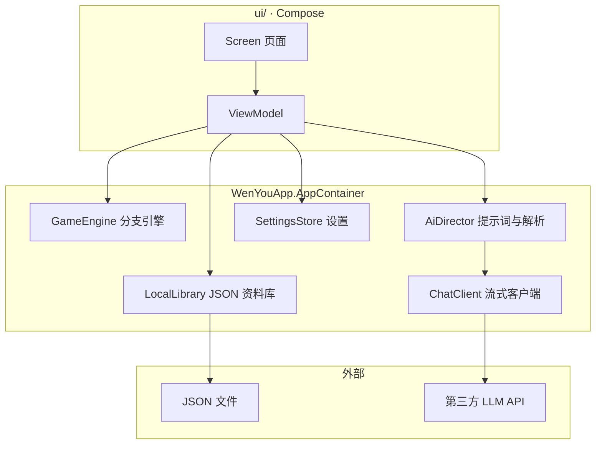
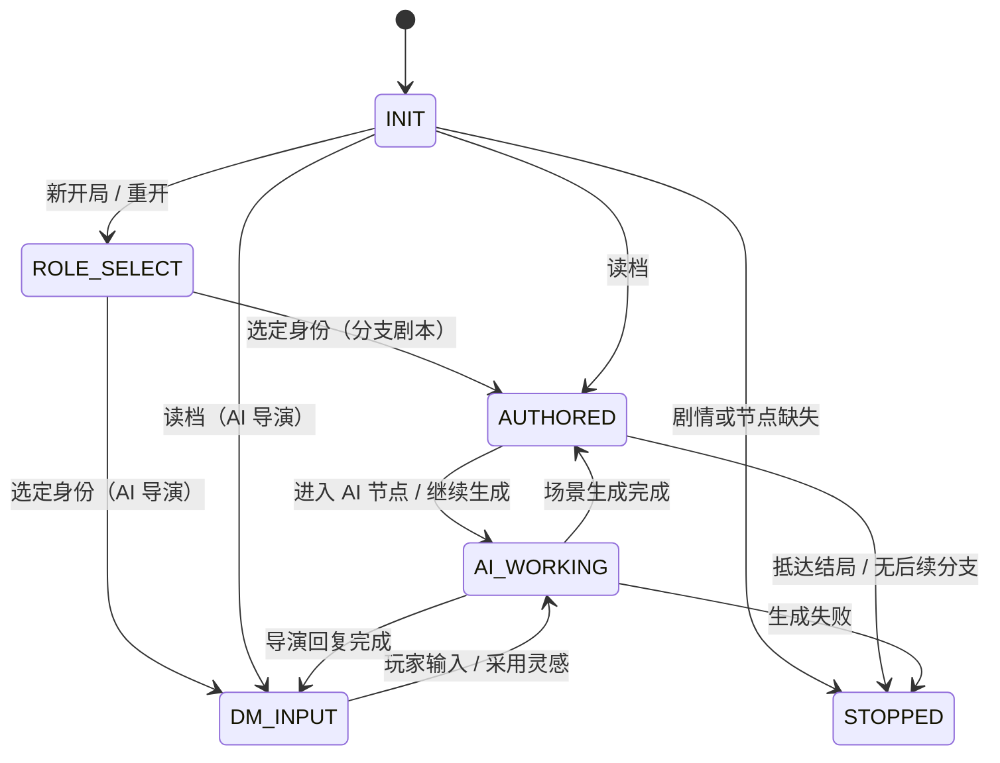
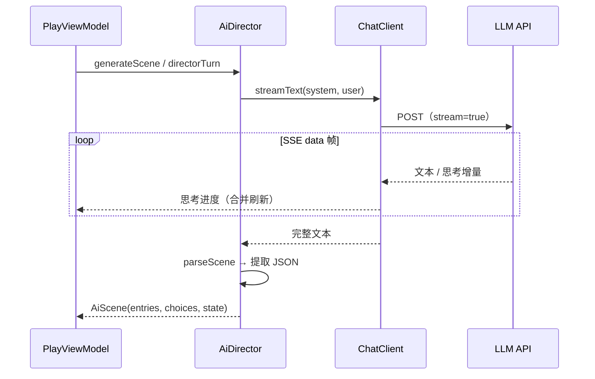

<div align="center">


# 星叙 · XingXu

**让你的故事继续。**

自编剧情、自定义角色与 AI 共创的 Android 文字冒险工坊——离线游玩分支剧本，或接入大模型，让 AI 导演与角色陪你即兴共创。

[](https://github.com/wangmikuwang/XingXu-Android/releases/latest)


[](LICENSE)
[](https://wangmikuwang.github.io/fdroid/)

### [⬇️ 下载最新版](https://github.com/wangmikuwang/XingXu-Android/releases/latest) · [📦 通过 F-Droid 安装](https://wangmikuwang.github.io/fdroid/)

[功能](#-亮点) · [快速开始](#-快速开始) · [玩法](#-三种玩法) · [开发者](#%EF%B8%8F-开发者) · [更新日志](CHANGELOG.md) · [致谢](#-致谢)

</div>

<br>

<table>
  <tr>
    <td align="center"><br><sub>首页 · 一键续写</sub></td>
    <td align="center"><br><sub>AI 导演 · 旁白与角色分栏</sub></td>
    <td align="center"><br><sub>分支剧本 · 选择推动剧情</sub></td>
    <td align="center"><br><sub>分支图 · 探索进度</sub></td>
  </tr>
</table>

<p align="center">
  <br>
  <sub>🫧 按住或拖动底栏：选中胶囊化作玻璃透镜，放大并折射下方图标</sub>
</p>

## ✨ 亮点

- 🎭 **两种故事，一个应用**：作者预编排的**分支剧本**完全离线可玩；**AI 导演**模式里，模型同时扮演主持人与角色，和你即兴共创。
- 🧑‍🤝‍🧑 **会记事的角色**：人设卡、0–100 状态值、人物关系与剧情记忆随存档保存；开局可选择扮演哪位角色。
- ✍️ **一句话创作**：一句创意生成完整剧情与人物，再用「一句话修改」微调，预览后才写入。
- 🗺️ **分支图与探索进度**：游玩中随时查看剧情走向，标出当前位置、已到达节点和已解锁结局。
- 🫧 **液态玻璃界面**：实时模糊与边缘折射的玻璃材质，按住底栏会浮起一枚会放大的透镜；也可切回 Material You。
- 🧭 **全年龄为主，题材多样**：内置刑侦、武侠、科幻、校园、家庭、民俗怪谈、赛博朋克、西幻冒险、唐朝悬疑、末日生存、妖怪日常与本格推理等题材；成人向预设需单独开启，内容开关只影响显示、不删数据。
- 📦 **分享与导出**：剧情和角色一键发送链接或文件，对方点开即可导入；也支持分享码、二维码海报；对局可导出成小说文本；整包备份随时迁移。
- 🔒 **本地优先**：所有数据只存在你的手机里；AI 请求直连你自己配置的服务商，密钥不上传。

## 🚀 快速开始

1. **安装**（Android 6.0 及以上，二选一）：
   - **直接下载**：到 [Releases](https://github.com/wangmikuwang/XingXu-Android/releases/latest) 下载 `XingXu-v版本号.apk`，首次安装请允许本应用「安装未知应用」。之后应用会自动检查更新，在应用内下载并校验。
   - **F-Droid**：在 F-Droid 客户端「设置 → 仓库」中添加 `https://wangmikuwang.github.io/fdroid/repo`，或在手机上打开[仓库页面](https://wangmikuwang.github.io/fdroid/)一键添加。仓库指纹：`885F92BA3C2DDD5EE6F095BB3E6796A194E4EE88F558FB95FCB4C18388A5B9E6`。两种方式的安装包签名相同，可以互相覆盖升级。
2. **开玩**：打开即可游玩内置剧情。标着「分支剧本」的故事完全离线，不需要任何配置。
3. **接入 AI（可选）**：设置 → AI 服务与生成 → 管理 AI 服务，添加服务商的地址、密钥和模型，先「测试连接」再保存。之后就能玩 AI 导演、AI 场景，以及一句话创作。

支持 OpenAI 兼容协议（DeepSeek、Kimi、GLM、Qwen、豆包、OpenRouter、硅基流动、小米 MiMo、Ollama 等），以及 Anthropic 与 Gemini 原生协议。

## 🎮 三种玩法

| 模式 | 怎么玩 | 需要 AI 吗 | 适合 |
| --- | --- | --- | --- |
| 分支剧本 | 作者预编排节点与选项，引擎按条件、效果、掷骰推进 | 不需要，完全离线 | 多线叙事、多结局 |
| AI 场景节点 | 分支骨架中插入 AI 节点，模型生成正文与动态选项，可接回主线 | 需要 | 框架稳定、局部自由发挥 |
| AI 导演 | 整局自由对话推进，模型同时扮演角色与主持人 | 需要 | 开放式探索叙事 |

## 📖 功能详解

### 游玩

- **对局界面**：AI 思考过程（可折叠）、旁白、角色台词分开显示，按发生顺序排列；AI 导演会给出走向灵感，点一下即可采用，也能自由输入。
- **选择身份**：开局或重开时可扮演剧情里的某位角色，或用自由身份；身份随存档保存。
- **剧情记忆与人物关系**：对局右上角的人物按钮查看 AI 累计记下的关键事件、好感与信任，以及人物之间的关系变化。
- **分支图**：分支剧本的选项上方点「分支图」，只读查看整部剧情，自动定位当前位置；「已到达 x / y 个节点 · 已解锁结局 a / b」帮你查漏补缺。探索记录随整包备份一起导出与合并。
- **存档**：随时存档、首页续玩；在剧情的「读取存档」中可重命名，留空恢复自动名称。
- **导出对局文本**：在剧情记忆侧栏或结局面板导出 .txt，按顺序保存旁白、角色台词与你的选择，不含 AI 思考过程。
- **成就馆**：7 项成长成就（初次启程、世界探索者、命运抉择、灵感火花、共创故事、旅途终章、结局收藏家）；反复读档不会刷进度，备份恢复也不会清空已解锁成就。

### 创作

- **手动编辑**：底栏中央「创建」新建剧情或角色。剧情由叙述、AI 场景、结局三类节点组成，支持进入效果、选项显示条件、选择效果、数值变量、场景标记、掷骰和 `${变量}` 文本插值；编辑页的「分支图」可点节点直接跳到对应位置。
- **角色卡**：名字、Emoji、性格、说话风格、背景与台词示范构成人设，注入 AI 提示；可设定 0–100 的状态值与标记。
- **底层基调**：全应用只有一份、可以自由改写的安全规则（设置 → 底层基调）。每一次 AI 请求都会把它放在最前面并在末尾再次确认，角色设定、剧情设定、导演要求、玩家输入和导入的分享内容都不能修改或绕过它；留空会恢复默认规则。
- **推进节奏**：对话页「⋯ → 推进节奏」可选慢 / 标准 / 快，随存档保存。
- **总结并开启新篇章**：对话太长或 AI 开始遗忘时，「⋯ → 总结并开启新篇章」把至今的剧情整理成可修改、可导出的前情提要，并在新存档中继续；人物状态、关系与标记保留，原进度另存一份。
- **一句话创作与修改**：一句创意生成剧情与人物的完整表单（导演要求、变量、节点分支、人设与规则）。创建页、剧情编辑页、人物编辑页都能「一句话修改」，先预览再应用，未要求修改的内容保持原样。

### 内容与分级

内置全年龄角色与剧情，题材涵盖都市言情、刑侦、武侠、科幻、校园、家庭、民俗怪谈、赛博朋克、西幻冒险、唐朝悬疑、末日生存、妖怪日常与本格推理，并提供可单独开启的成人向预设。剧情与角色可标记为 **18+**，受设置中的成人内容开关约束；未标记的内容归为「全年龄」。内容开关只影响列表显示，不会删除本地数据。

### 外观

- **两种界面风格**：Material You（支持动态取色）与液态玻璃，均支持跟随系统、浅色与深色。
- **液态玻璃**：浮动导航与对局操作区实时采样背后内容，带高斯模糊、边缘折射、高光与阴影；文字和图标单独绘制，保持清晰。按住或拖动底栏，选中胶囊会膨胀成放大、折射的玻璃透镜（Android 13 及以上），松手弹回。Android 12 使用模糊，Android 8–11 回退为可读的着色材质。
- **外观与主题**：界面预设、屏幕帧率、图标与弹窗样式、17 套配色预设、色彩风格、高级配色、字号与界面缩放、字体加粗、开屏壁纸、桌面图标（可用相册图片自定义桌面快捷图标）和界面语言（简体中文、繁體中文、English；AI 也用所选语言写作新内容）。
- **字体**：默认使用离线内置的完整版[霞鹜文楷](https://github.com/lxgw/LxgwWenKai)（Regular 与 Medium 两个字重，粗体使用真实字重，生僻字也以楷体显示），也可导入自己的字体。
- **系统长截图**：Android 12 及以上支持滚动截图，浮层不会遮挡正文。

### 分享与数据

- **一键分享**：剧情和角色菜单里选「分享」，可发送链接（对方点开即在应用中打开）、发送 .wenyou 文件（点开即导入），或复制分享码。
- **无感导入**：复制了含分享码的消息后打开应用会自动识别；从其他应用「分享到」星叙或用星叙打开文件也能导入。导入前先预览内容，已有的剧情和角色会跳过，不会被覆盖。
- **二维码**：大内容自动拆成多页轮播，可面对面扫码；也能「保存海报」把所有页拼成一张图，对方在「导入 → 相册识别」选这一张即可。
- **整包备份**：设置 → 存储与备份，导出或导入全部剧情、角色、存档、服务配置、成就与探索记录。

### AI 服务

- **多协议流式输出**：统一 SSE 流式接收，提供连接测试与模型列表拉取。
- **用量与费用**：记录本机最近 100 次请求的实际 tokens、耗时与状态；可填写模型单价，DeepSeek 官方接口支持官方价格快照与峰谷时段。未知用量不按零计，账单以服务商为准。
- **生成实时通知**：可选的生成进度通知，显示阶段与真实耗时，不含剧情内容；已完成小米超级岛代码适配（需平台授权后生效）。

### 更新

- 启动和返回前台时自动检查官方正式发布，在应用内下载，下载后核对 SHA-256、大小、包名、签名与版本，再交给系统安装界面确认。
- 仓库中的 `update-policy.json` 声明最低支持版本，低于该版本时只显示升级页。更新请求只访问公开的 GitHub 接口。

### 彩蛋

设置页与成就馆藏着三个小惊喜，只在本机显示，不改动存档和成就。

<details>
<summary>查看彩蛋线索（剧透）</summary>

- 设置 → 系统与关于，连续点五次标题「星叙」：幕后导演。
- 长按同一标题：第四面墙。
- 成就馆长按标题（或连续点五次）：好奇心万岁隐藏奖杯，不计入七项成就。

</details>

## 🔒 隐私

- 剧情、角色、存档、服务配置与 AI 密钥只保存在应用私有目录，不上传到任何服务器。
- 导出的备份文件默认不含 API Key；系统的云备份与设备迁移也不会带走 API Key。
- AI 请求由手机直接发给你配置的服务商；应用更新只访问公开的 GitHub 接口，不携带任何个人数据。
- 分享链接、文件、分享码和二维码只包含你选中的剧情或角色，不含密钥、存档或服务配置；链接里的内容放在网址 # 之后，不会发送到网页服务器。

## 🛠️ 开发者

<details>
<summary><b>架构总览</b></summary>

应用按「UI → ViewModel → 容器服务 → 引擎 / 网络 / 持久化」分层，`WenYouApp.AppContainer` 为手写依赖注入入口，不引入 Hilt：



对局页由 `PlayViewModel` 统一驱动状态机，三种玩法共用同一套阶段：



</details>

<details>
<summary><b>AI 生成链路与协议适配</b></summary>

每次生成先拼提示词（底层基调、人设卡、前情提要与剧情记忆、最近剧情、变量与角色状态快照、推进节奏），以 SSE 逐帧接收增量，结束后解析为结构化结果并清洗正文（剥离 markdown、剔除思考泄漏）：



| 协议 | 聊天端点 | 增量字段 | 模型列表 |
| --- | --- | --- | --- |
| OpenAI 兼容 | `POST {base}/chat/completions` | `choices[0].delta.content`，推理模型另取 `reasoning_content` / `reasoning` | `GET {base}/models` |
| Anthropic | `POST {base}/v1/messages` | `content_block_delta` 的 `delta.text` | `GET {base}/v1/models` |
| Gemini | `POST {base}/models/{model}:streamGenerateContent?alt=sse` | `candidates[0].content.parts[].text` | `GET {base}/models` |

模型输出约定为单个 JSON 对象，由 `AiDirector.parseScene` 解析；思考过程单独折叠，不会被当作台词：

```json
{
  "entries": [
    { "speakerId": "", "text": "本幕旁白……" },
    { "speakerId": "角色id", "text": "角色台词……" },
    { "speaker": "临时人物称谓", "text": "临时人物台词……" }
  ],
  "choices": [
    { "text": "选项一" },
    { "text": "带主线出口的选项[to:node_id]" }
  ]
}
```

`[to:节点id]` 仅用于 AI 场景节点接回作者分支。实现集中在 `data/llm/ChatClient.kt` 与 `data/ai/AiDirector.kt`。

</details>

<details>
<summary><b>数据文件</b></summary>

运行时数据以 JSON 存于应用私有目录，字段对手工编辑友好；每次写入先写临时文件再原子替换：

| 文件 | 内容 |
| --- | --- |
| `providers.json` | AI 服务档案（地址、密钥、模型、单价） |
| `characters.json` | 角色卡 |
| `stories.json` | 剧情节点图与会话设置 |
| `saves.json` | 存档（日志、变量与角色状态快照） |
| `baseline.txt` | 底层基调（全应用唯一） |
| `achievements.json` | 成就进度 |
| `progress.json` | 分支剧本的探索记录 |
| `usage.json` | 最近 100 次 AI 请求的用量与费用 |

内置预设位于 `app/src/<flavor>/assets/presets/`，启动时按 id 合并进资料库，只补不覆盖；已合并的文件会被记录，用户删除的内置内容不会被写回。

</details>

<details>
<summary><b>构建与测试</b></summary>

环境：JDK 17、`compileSdk 37`、`minSdk 23`、`targetSdk 36`，Android Gradle 插件 9.4、Kotlin 2.4，仓库自带 Gradle Wrapper 9.8，可直接用 Android Studio 打开。

```bash
./gradlew :app:assembleDebug        # 调试包
./gradlew :app:assembleRelease      # 正式包（R8 压缩与资源裁剪）
./gradlew :app:test :app:lint       # 单元测试与静态检查
./gradlew :app:connectedCheck       # 设备上的界面测试（需模拟器或真机）
```

构建输出默认放在 Gradle 用户目录的 `caches/wnq-build/XingXu`，以避开同步盘文件锁；可用环境变量 `WENYOU_BUILD_DIR` 指定位置。网络相关测试使用本地拦截响应，不需要 API Key。

版本号按 `x.yy.zz` 维护在 `version.properties`：

- 修复 bug：`./gradlew bumpVersion`，`zz` +1（满 100 进位）
- 新功能或重大变化：`-Pbump=minor`，`yy` +1 且 `zz` 归零（满 10 进位）
- 重大架构变化：`-Pbump=major`，`xx` +1 且其余归零

`versionCode` 每次递增；发布前先升版本。

</details>

<details>
<summary><b>目录结构</b></summary>

```text
app/src/main/java/io/wenyou/textquest/
├── CrashLog.kt        崩溃日志多路径落盘
├── data/model/        持久化模型
├── data/engine/       分支引擎、成就、对局文本导出（纯逻辑无 IO）
├── data/ai/           提示词组装、模型输出解析与正文清洗
├── data/llm/          多协议流式客户端、品牌预设、用量统计
├── data/repo/         本地 JSON 资料库与设置
└── ui/                Compose 页面、ViewModel、主题与液态玻璃
third_party/           随包组件的来源与许可
```

</details>

<details>
<summary><b>设计取舍与已知限制</b></summary>

- 不引入 Hilt 与 Room：依赖注入手写，持久化直接读写 JSON。单文件写入是原子的，但整包导入跨多个文件，中途失败时请重新导入完整备份。
- 分享码解压后上限 8 MiB，超限请改用整包备份。
- AI 上下文取最近若干条日志，超出部分截断；剧情记忆是有限长度的 AI 摘要，不保证保留所有细节。
- 流式生成结束前不写入对局日志，存档始终是一致状态。
- 正文清洗只作用于 AI 生成内容，作者手写的节点文本保持原样。

</details>

## 🙏 致谢

这个项目从一个想法开始，一路有 AI 伙伴并肩：**DeepSeek 的 Harness**、**OpenAI 的 Codex** 与 **Anthropic 的 Claude**，帮助把想法一点点变成现实。感谢的话写在[这条置顶 issue](https://github.com/wangmikuwang/XingXu-Android/issues/1) 里。

- [wangmikuwang](https://github.com/wangmikuwang)：项目发起、整体架构与产品设计。
- Little Code Sauce（AI 编程搭档）：功能实现、代码审核与优化、构建与发布流程。

随包使用或参考的开源项目：

| 项目 | 用途 | 许可 |
| --- | --- | --- |
| [Ionicons](https://github.com/ionic-team/ionicons) | 圆润线框图标（子集） | MIT |
| [霞鹜文楷 LXGW WenKai](https://github.com/lxgw/LxgwWenKai) | 默认字体（Regular 与 Medium，未经修改） | SIL OFL 1.1 |
| [Material Color Utilities](https://github.com/material-foundation/material-color-utilities) | 动态配色算法 | Apache-2.0 |
| [ZXing](https://github.com/zxing/zxing) | 二维码生成与识别 | Apache-2.0 |
| [OpenCC](https://github.com/BYVoid/OpenCC) | 繁体中文界面的简繁字表 | Apache-2.0 |
| [LiquidGlassKMP](https://github.com/philipplackner/LiquidGlassKMP) | 液态玻璃的分层设计参考（未使用其代码） | — |

来源与许可原文见 [`third_party/`](third_party/)。

## 📜 许可证

星叙以 [GNU 通用公共许可证 v3.0](LICENSE)（GPL-3.0-only）开源：你可以自由使用、学习、修改和再分发，分发修改版时也须以同样的许可证公开源代码。随包的第三方组件保留各自的许可证。
